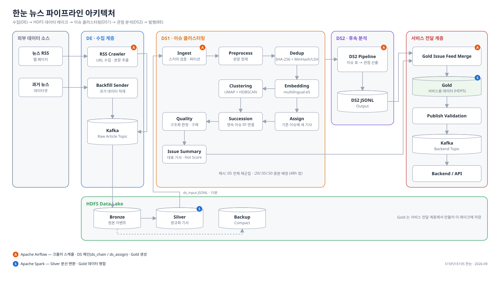

# 한눈 · 뉴스 중복 제거·이슈 군집 파이프라인 (DS1)

> 하루 수천 건의 뉴스 기사를 중복 없이 **사건(이슈) 단위로 묶고**, 이슈마다 언론사들의
> **관점 차이를 나란히** 보여 주는 서비스 "한눈"의 데이터 사이언스 파트.
> 모토는 *사실 먼저, 관점은 원할 때*.

SSAFY 특화 프로젝트 (빅데이터 분산) · 2026.08 ~ 09 · 5인 · 이 저장소는 팀 모노레포의 `data/ds/` 를
커밋 이력째 분리한 것이다. 파이썬 패키지 `hannun` 하나를 DS1(이 문서의 필자)과 DS2 가 같이 만들었고,
이 README 는 DS1 의 범위를 중심으로 쓴다. 팀 내부용 README 원문은 [docs/DS_README.md](docs/DS_README.md).

## 무엇을 풀었나

13개 언론사 RSS 에서 15분마다 들어오는 기사는 하루 4천 건이 넘는데, 그중 여섯 건에 하나는 이미 있는
내용(통신사 전재·재발행·긴 기사 속 속보)이고, 같은 사건이 수십 건으로 흩어져 있다. 이 파트는 그 기사
더미를 **48시간 창 단위로 이슈로 정리해 매시 갱신**하고, 사용자가 보는 이슈 번호가 갱신마다 흔들리지
않게 하는 일을 맡았다.

## 아키텍처



DS1 체인 9단계 (`scripts/run_daily_chain.sh`, EC2 도커 이미지 + Airflow `ds_chain`·`ds_assign` DAG):

| 단계 | 모듈 | 하는 일 |
|---|---|---|
| ingest | `hannun.ingest` | 공통 기사 JSON 검증 → Gold parquet (발행일 파티션, `article_id` 멱등) |
| preprocess | `hannun.preprocess` | 언론사별 규칙으로 본문 정제 (사이트 잔재·위젯·저작권 고지 제거) |
| dedup | `hannun.dedup` | 원문 SHA-256 → 4-gram MinHash/LSH 후보 → TF-IDF 코사인·포함률 검증 → 대표 중심 star 그룹 |
| embed | `hannun.embedding` | multilingual-e5-small 로 대표 기사 벡터화, 인코더 입력 해시로 재사용 판정 |
| cluster / assign | `hannun.clustering`, `hannun.quality.assign` | UMAP + HDBSCAN. 매시 :05 전체 재군집, :20/:35/:50 은 기존 이슈에 새 기사만 배정 |
| succeed | `hannun.clustering.succession` | 재군집마다 리셋되는 군집 번호를 구성원 득표로 영속 이슈 ID 에 연결 |
| quality | `hannun.quality` | 구조화 판정, 노이즈 구제(이슈 중심 코사인 0.85), 품질 지표 |
| feed | `hannun.feed` | 대표 기사·hot score·카테고리(팀 어휘 8개) 요약 |
| export | `scripts/export_ds2_jsonl.py` | DS2 관점 분석을 이슈 단위 병렬로 돌려 BE 연동 JSONL 로 내보냄, 체인 완료 마커 기록 |

## 핵심 설계와 근거

각 결정의 실험 수치와 이유는 `docs/ds1/tickets/` 의 티켓 문서에 있다.

- **3층 중복 제거** — 완전 중복은 SHA-256, 근사 중복은 문자 4-gram MinHash(128 순열) 를 Jaccard·containment LSH 두 인덱스에 넣어 후보를 좁힌 뒤 TF-IDF 코사인 0.95 또는 포함률 0.90(짧은 쪽 300자 이상)으로 확정. 후보의 97% 가 검증에서 떨어진다. 창 전체를 한 번에 처리해 자정을 넘는 전재를 놓치지 않는다. → [10](docs/ds1/tickets/S15P21E105-10.md), [123 §서명 캐시](docs/ds1/tickets/S15P21E105-123.md)
- **임베딩 모델 선정** — 후보 세 모델의 품질 지표가 동점이라 운영 비용(속도·차원)으로 e5-small 채택. 입력은 제목 + 본문 앞 500자. → [11](docs/ds1/tickets/S15P21E105-11.md)
- **군집과 창** — 48h 창을 UMAP 5차원으로 줄여 HDBSCAN. 매시 전체 재군집 + 15분 증분 배정(문턱 0.85)의 하이브리드는 시뮬레이션(배정 커버리지 vs 재군집 일치도)과 운영 실측으로 정했다. → [89](docs/ds1/tickets/S15P21E105-89.md), [102](docs/ds1/tickets/S15P21E105-102.md)
- **고정 UMAP 지도** — 매시 지도를 다시 그리면 경계의 이슈가 쪼개졌다 붙었다 한다. 창당 한 번 학습하고 새 기사는 transform 으로 얹되, 고정 지도가 못 잡는 새 사건은 384차원 코사인 평균연결(0.70)로 2단계 탐지. → [128](docs/ds1/tickets/S15P21E105-128.md)
- **이슈 ID 승계** — 새 군집의 구성원이 직전에 어느 이슈였는지 득표해 과반(2건 이상)이면 그 ID 를 잇는다. 같은 창의 직전 실행을 우선 승계원으로 써 재실행에도 ID 가 안 흔들린다. → [97](docs/ds1/tickets/S15P21E105-97.md)
- **골드셋 채점** — 팀이 기사 쌍 400개를 "같은 이슈인가"로 채점한 정답지로 정밀도·과분리·재현율을 재고, 모든 군집 변경을 같은 정답지로 재검증했다. → [104](docs/ds1/tickets/S15P21E105-104.md)
- **저장 원자성과 캐시 무효화** — 코드 리뷰에서 찾은 벡터 캐시 오염(늦게 접힌 중복 기사·본문 변경)과 지도 파일 세 개의 비원자적 교체를 입력 해시 재사용 판정, 세대 디렉터리 + 포인터 교체, 체인 완료 마커(`ds_output/_chain_status.json`)로 고쳤다. → [131](docs/ds1/tickets/S15P21E105-131.md), [132](docs/ds1/tickets/S15P21E105-132.md)

## 정량 결과

| 항목 | 수치 | 출처 |
|---|---|---|
| 중복 제거율 (2023년 기사 187만 건) | 16.3% 제거 — 근사 20.1만 · 포함 6.2만 · 완전 4.1만 | 2023 데이터셋 재분석 (발표 자료) |
| 후보 → 확정 (2023-09-27 하루 6,535건) | 후보 60,577쌍 → 확정 1,767쌍 | 2023 데이터셋 재분석 (발표 자료) |
| 군집 정밀도 (골드셋 400쌍) | 0.455 → 0.658 (정제 규칙) → 0.744 (이웃 수 15 → 50) | 티켓 119, 104 |
| 시간당 이슈 ID 생성 / 소멸 | 134 / 144 → 평일 25~66 / 7~34, 주말 6~37 / 4~33 | 티켓 128 |
| 같은 창 재실행 시 이슈 ID 유지 | 0% → 100% (509 / 509) | 티켓 97 |
| 재군집 `cluster` 단계 | 68초 → 25초 | 티켓 128 |
| DS2 연동 내보내기 | 879초 → 108~154초 (3프로세스 병렬 + 미변경 이슈 재사용) | 티켓 123 |
| 매시 체인 전체 | 약 6.5분 (배정 모드 2.5분) | 티켓 132 |

## 트러블슈팅 (요약)

1. **잘못 묶인 이슈, 범인은 전처리** — 첫 골드셋 채점 정밀도 0.455. 알고리즘이 아니라 실수집 본문 앞 500자에 섞인 사이트 안내 문구(연합뉴스 "세 줄 요약" 안내 977건/4,043건 등)가 무관한 기사를 뭉치게 했다. 언론사별 규칙 15개와 위젯 블록 절단 규칙으로 0.658, 남은 과분리는 설정 문제라 이웃 수 조정으로 0.744. → [119](docs/ds1/tickets/S15P21E105-119.md)
2. **매시 이슈가 출렁인다** — 승계 규칙만으로는 시간당 이슈 번호가 130개씩 바뀌었다. 원인은 매시 재학습되는 UMAP 이었고, 고정 지도로 바꿔 수십 개로 줄였다. → [128](docs/ds1/tickets/S15P21E105-128.md)
3. **파이프라인은 초록불인데 화면에 같은 이슈가 여럿** — 창 전환 첫 실행이 옛 번호를 못 이으면 그날 굳는 문제. DE 발행 경계의 번호 복원과 함께, 양 지표뿐이던 대시보드에 질 지표 5종(라벨 실패율, 중립 쏠림, 어제 번호 승계 건수 등)을 더했다. → [130](docs/ds1/WORKLOG.md)

자세한 기록은 [docs/ds1/WORKLOG.md](docs/ds1/WORKLOG.md), [docs/ds1/TROUBLESHOOTING.md](docs/ds1/TROUBLESHOOTING.md).

## 실행

```bash
python -m venv .venv && source .venv/bin/activate      # Windows: .\.venv\Scripts\activate
pip install -e ".[dev]"                                  # 임베딩·군집까지 돌리려면 ".[dev,embedding,clustering]" (파이썬 3.12)
python scripts/make_sample_data.py                       # 합성 샘플 입력 생성
hannun-ingest --input samples/articles_sample.jsonl --gold-root gold -v
hannun-preprocess --gold-root gold -v
hannun-dedup --gold-root gold -v
hannun-embed --gold-root gold -v
hannun-cluster --gold-root gold --start-date 2026-08-20 --end-date 2026-08-21 -v
```

운영 체인은 `scripts/run_daily_chain.sh` (환경변수 `MODE=assign`, `START`/`END`, `INGEST_DAYS`), 컨테이너는 `Dockerfile`,
스케줄은 `dags/`. 서버 절차는 [docs/ds1/EC2_RUNBOOK.md](docs/ds1/EC2_RUNBOOK.md).

## 테스트

```bash
pytest tests/ -q                       # 406개, 모델 다운로드 없이 약 1분
flake8 src tests scripts dags --select=E9,F63,F7,F82,E501 --max-line-length=110
```

테스트는 파이프라인을 실제 저장소(임시 디렉터리)에 끝까지 돌려 검증한다. 인코더와 UMAP 은 결정적 스텁으로 바꿔
모델 없이도 재사용 판정·세대 교체·승계 같은 동작을 재현한다.

## 저장소 구성

```
src/hannun/<단계>/   단계별 패키지 — 순수 로직 + pipeline.py + cli.py
scripts/             운영 체인, DS2 내보내기, 시뮬레이션·골드셋 채점 스크립트
dags/                Airflow DAG (ds_chain 매시 :05, ds_assign :20/:35/:50)
tests/               pytest, 모듈과 1:1
docs/ds1/            티켓별 설계·실측 문서, 작업기록, 트러블슈팅, 코드 스타일, 런북, 골드셋 라벨링 자료
docs/ds2/            DS2 문서
docs/contracts/      DE → DS 기사 JSON, DS1 → DS2 이슈 표 계약
samples/             커밋되는 합성 샘플 입력
```

## 기여

| 범위 | 사람 |
|---|---|
| DS1 — 적재·정제·중복 제거·임베딩·군집·승계·품질·피드·운영 체인, 이 저장소 커밋의 대부분 | 제다빈 |
| DS2 — 관점 분석(`hannun.stance`, `viewpoint`, `enrichment`, 키워드), 내보내기 스크립트의 분석 부분 | 구윤지 |
| DE 연동 — 내보내기 필드 조정 | 사지한 |

팀 전체(FE·BE·DE)의 코드는 이 저장소에 없다. 골드셋 라벨링 자료(`docs/ds1/labeling/`)의 채점자 이름은
L1~L6 으로 익명화했다.
